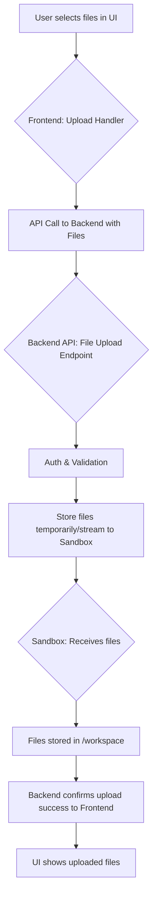

# Activity Diagrams

This document outlines key user and system activities within the application using Mermaid diagrams to visualize the flow.

## User Sends Message & Agent Responds (Happy Path, with Tool Use)

This diagram details the sequence of events when a user sends a message, and the agent processes it, uses a tool, and streams back a response. This represents a common "happy path" scenario involving significant system interaction.

```mermaid
graph TD
    subgraph Frontend
        U[User] -->|Sends message via UI| ChatInput[Chat Input Component]
        ChatInput -->|Calls handleSubmitMessage| Page[ThreadPage Component]
        Page -->|Optimistically updates UI| UIDisplay[Message List UI]
        Page -->|Shows loading state| UIDisplay
    end

    subgraph Backend API [/api/v1]
        Page -->|POST /threads/{threadId}/messages & /threads/{threadId}/agent/start| APIEndpoints[API Endpoints]
        APIEndpoints -->|Auth & Basic Validation| AuthN[Auth Middleware]
        AuthN -->|If OK| BillingChecks[Billing/Subscription Checks]
        BillingChecks -->|If OK| TaskEnqueue[Task Enqueue Logic]
        TaskEnqueue -->|Enqueues agent task (project_id, thread_id, agent_run_id)| RabbitMQ([RabbitMQ/Dramatiq])
        APIEndpoints -->|Returns agent_run_id to Page| Page
        Page -->|Updates agentRunId state| PageState[ThreadPage State]
    end
    
    subgraph Background Worker (Dramatiq)
        RabbitMQ -->|Dequeues task| AgentWorker[Agent Background Worker]
        AgentWorker -->|Calls agent.run()| AgentRun[agent.run function]
        AgentRun -->|Initializes ThreadManager, Langfuse Trace| TM[ThreadManager]
        TM -->|Prepares messages, system prompt| LLMParams[LLM Parameters]
        TM -->|Calls LLM Service (e.g., LiteLLM)| LLMService_Call[LLM Service Interface]
        
        LLMService_Call -- Response with XML Tool Call --> TM
        TM -->|Detects & Parses Tool Call (e.g., SandboxFilesTool)| ToolParsing[ResponseProcessor - Tool Parsing]
        ToolParsing -- Valid Tool Call --> SandboxToolExecution[Sandbox Tool Execution Logic]
        
        SandboxToolExecution -->|Invokes tool method (e.g., create_file)| SandboxInfra[Sandbox Infrastructure]
        
        SandboxInfra -- Tool Result (e.g., file created success) --> SandboxToolExecution
        SandboxToolExecution -- Formats Tool Result --> TM
        TM -->|Adds tool result to messages| MessagesDBStore([Database - messages table])
        TM -->|Prepares messages with tool result| LLMParams2[LLM Parameters with Tool Result]
        TM -->|Calls LLM Service again| LLMService_Call
        
        LLMService_Call -- Final Assistant Response (streaming) --> TM
        TM -->|Streams response chunks| RedisStream[Redis Pub/Sub & List]
    end

    subgraph LLM Service
        LLMService_Call -->|Sends request| LLMEndpoint[Actual LLM API (e.g., OpenAI, Anthropic)]
        LLMEndpoint -- LLM Response (XML or Text) --> LLMService_Call
    end
    
    subgraph Sandbox
        SandboxInfra -->|Executes operation (e.g., write file)| SandboxFS[Sandbox File System]
        SandboxFS -- Operation success/failure --> SandboxInfra
    end

    subgraph Database (Supabase)
        AuthN -->|Verifies user session| DBAuth([Auth Table])
        BillingChecks -->|Checks subscription status, usage| DBBilling([Billing/Subscriptions Tables])
        TaskEnqueue -->|Creates agent_runs record with 'running' status| DBAgentRuns([agent_runs table])
        TM --> MessagesDBStore
        MessagesDBStore -->|Stores assistant messages, tool calls, tool results| DBMessages([messages table])
    end
    
    subgraph Frontend [Streaming Response]
        RedisStream -- Pub/Sub new message notification --> PageState
        PageState -->|Triggers useAgentStream hook to fetch from Redis List| AgentStreamHook[useAgentStream Hook]
        AgentStreamHook -->|Receives response chunks| Page
        Page -->|Updates UI with streaming text/tool status| UIDisplay
        AgentStreamHook -->|On stream end/error, updates final status| PageState
        Page -->|Hides loading state, shows final message| UIDisplay
    end

    %% Styling for clarity
    style U fill:#C9E4FF,stroke:#333,stroke-width:2px
    style Page fill:#D5F5E3,stroke:#333,stroke-width:2px
    style APIEndpoints fill:#FCF3CF,stroke:#333,stroke-width:2px
    style AgentWorker fill:#FADBD8,stroke:#333,stroke-width:2px
    style LLMService_Call fill:#E8DAEF,stroke:#333,stroke-width:2px
    style SandboxInfra fill:#D6EAF8,stroke:#333,stroke-width:2px
    style DBAgentRuns fill:#E5E7E9,stroke:#333,stroke-width:2px
    style RedisStream fill:#FFDAB9,stroke:#333,stroke-width:2px
```

## Initial Agent Session Setup (`/agent/initiate`)

This diagram will show the flow when a user initiates a new agent session, typically from a landing page or dashboard. This involves creating a new project, thread, sandbox, and starting the first agent run.

```mermaid
graph TD
    %% Placeholder for Initial Agent Session Setup diagram
    A[User clicks "Start New Agent"] --> B{Backend API: /agent/initiate}
    B --> C[Auth Check]
    C --> D[Billing Check]
    D --> E[Create Project in DB]
    E --> F[Create Thread in DB]
    F --> G[Create Sandbox (Daytona)]
    G --> H[Update Project with Sandbox Info]
    H --> I[Enqueue Agent Task (Dramatiq)]
    I --> J[Return thread_id, agent_run_id to User]
    J --> K[Frontend navigates to Thread Page]
```

## User File Upload Process

This diagram will illustrate how files are uploaded by the user, processed by the backend, and made available in the agent's sandbox environment.



## Agent Using a Sandbox Shell Tool

This diagram will focus on the specific interaction when an agent decides to use the shell tool to execute commands within its sandbox.

```mermaid
graph TD
    %% Placeholder for Agent Using Sandbox Shell Tool diagram
    A[Agent (LLM) decides to use Shell Tool] --> B{ResponseProcessor: Parses Shell Tool XML}
    B --> C{SandboxShellTool: execute_command method}
    C --> D[Construct command for Daytona]
    D --> E{Daytona SDK: Execute command in Sandbox}
    E --> F[Sandbox: Command runs in shell]
    F --> G[Command Output (stdout/stderr) captured]
    G --> E
    E --> C
    C --> H[Format result (output, error, exit code)]
    H --> A[Agent receives Shell Tool result for next step]
```

## User Streaming Agent Responses (SSE Flow)

This diagram will provide a more focused view on the Server-Sent Events (SSE) mechanism used for streaming agent responses (text, tool calls, status updates) from the backend (via Redis) to the frontend.

```mermaid
graph TD
    %% Placeholder for User Streaming Agent Responses (SSE Flow) diagram
    subgraph Backend
        AgentWorker[Agent Worker] -->|Writes chunks to Redis List| RedisList([Redis List: agent_run:{id}:responses])
        AgentWorker -->|Publishes "new" to Redis Channel| RedisPubSub([Redis Pub/Sub: agent_run:{id}:new_response])
        AgentWorker -->|Publishes "STOP" on completion/error| RedisControlChan([Redis Pub/Sub: agent_run:{id}:control])
    end

    subgraph Frontend
        Page[ThreadPage] -->|Establishes SSE connection via /agent-run/{id}/stream| APIStreamEndpoint[Backend API: /stream endpoint]
        APIStreamEndpoint -->|Reads initial chunks from Redis List| RedisList
        APIStreamEndpoint -->|Subscribes to Redis Pub/Sub channels| RedisPubSub
        APIStreamEndpoint -->|Subscribes to Control Channel| RedisControlChan
        
        RedisPubSub -- "new" event --> APIStreamEndpoint
        APIStreamEndpoint -->|Fetches new chunks from Redis List| RedisList
        APIStreamEndpoint -- SSE data chunk --> Page
        
        RedisControlChan -- "STOP" event --> APIStreamEndpoint
        APIStreamEndpoint -- Closes SSE connection --> Page
        
        Page -->|Updates UI with new content| ChatDisplay[Chat Display]
    end
```
